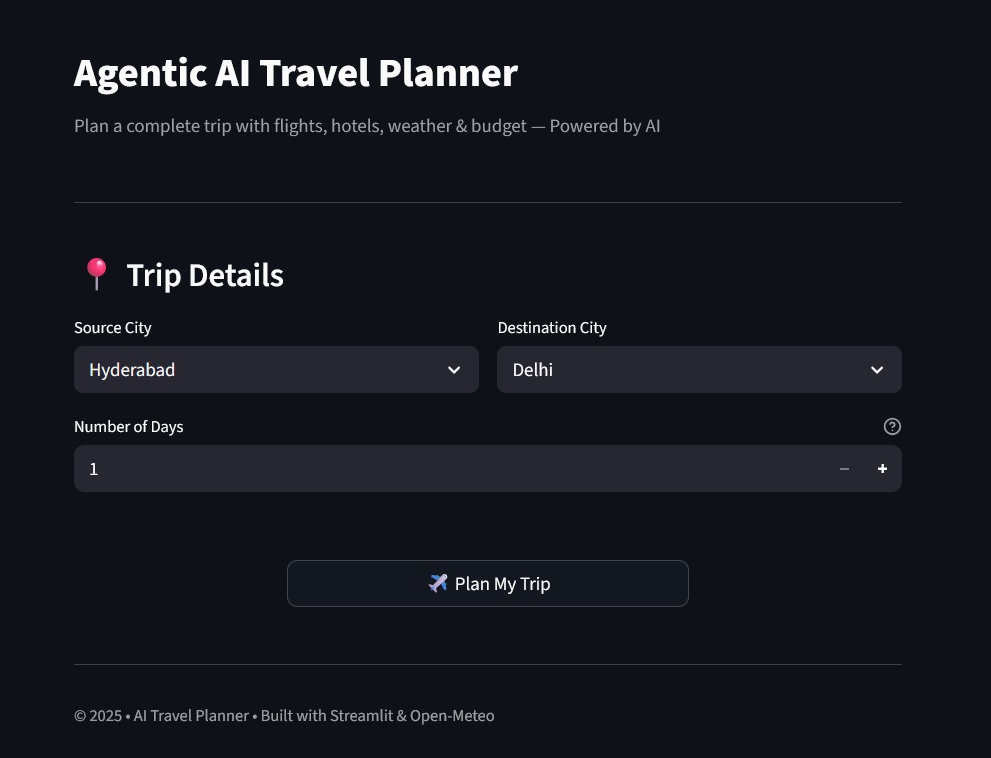
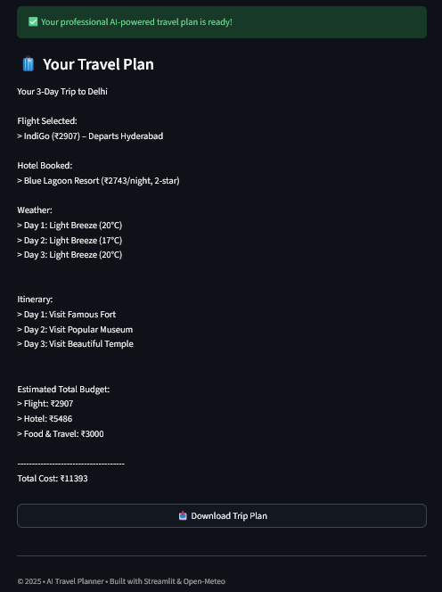

# Agentic-AI-Travel-Planner
🧳 AI Travel Planner App

An intelligent AI-powered Travel Planner built using Streamlit that helps users plan trips efficiently by generating personalized travel suggestions based on user preferences. The app provides a clean, professional dashboard experience with a fully dark-themed UI.

## **Features** 
* Personalized travel planning based on user inputs
* AI-powered recommendations using an agent-based architecture
* Smart itinerary generation
* Professional dark-mode dashboard UI
* Fast and interactive Streamlit web application
* Modular and scalable code structure

## **Tech Stack**

* Frontend & UI: Streamlit (Custom CSS – Dark Mode)
* Backend / Logic: Python
* AI Agent: Custom Travel Agent

## **Libraries**

* Streamlit
* Python standard libraries
* Deployment: Streamlit Cloud / Local

## **Project Structure**
```bash
Agentic-AI-Travel-Planner/
├── app.py
├── requirements.txt
├── README.md
├──data/
   ├── flights.json
   ├── hotels.json
   ├── places.json
├── agent/
│   ├── __init__.py
│   └── travel_agent.py
├── tools/
│   ├── __init__.py
│   ├── budget_tool.py
│   ├── flight_tool.py
│   ├── hotel_tool.py
│   ├── places_tool.py
│   └── weather_tool.py
```
## **Installation & Setup**

1️⃣ Clone the Repository
git clone https://github.com/shivavadla931/Agentic-AI-Travel-Planner
cd travel-planner-app

2️⃣ Install Dependencies
pip install -r requirements.txt

3️⃣ Run the Application
streamlit run app.py

## **Application Link**

https://agentic-ai-travel-planner.streamlit.app/

## **Application Preview**

The app features a fully dark professional dashboard with a modern layout designed for better readability and user experience.

### Home Page


### Results Page


## **Use Cases**

* Planning personal trips
* Creating quick travel itineraries
* Exploring destinations based on preferences
* Demonstrating AI-powered decision support systems

## **Future Enhancements**

* Map-based destination visualization
* Real-time flight and hotel data integration
* Day-wise itinerary planning
* Multi-language support
* User authentication and saved trips

## **Conclusion**

The AI Travel Planner App showcases how AI agents and modern web frameworks like Streamlit can be combined to build intelligent, user-friendly applications. This project emphasizes clean UI design, modular architecture, and practical AI usage.

## **Author**

Vadla Shiva Kumar

📧 shivavadla931@gmail.com

🔗 https://github.com/shivavadla931
